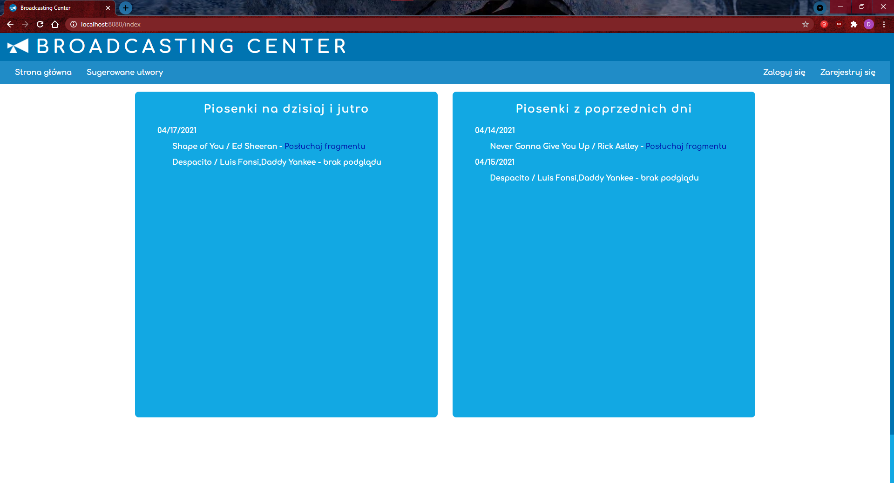

# Broadcasting Center
@LisKrystian
Strona **Broadcasting Center** to aplikacja przeglądarkowa, służąca do głosowania i wybierania utworów przez społeczność Zespołu Szkół Elektrycznych. Utwory te później są odtwarzane w radiowęźle szkolnym. Pozwala również sprawdzić, jakie utwory były odtwarzane w dniach poprzednich. Do przeglądania utowrów, które były lub będą odtwarzane nie jest wymagane posiadanie konta, lecz zalogowanie się jest niezbędne, aby móc brać czynny udział w wybieraniu i głosowaniu na utwory.

## Ścieżki
@lukitom
Pod adresem **"/"** i **"/index"** znajduje się strona główna. Na niej znajdują się dwie cześci. Pierwsza zawiera listę utworów, których odtworzenie jest zaplanowane na dzisiaj oraz na następny dzień. Natomiast druga część zawiera historię utworów z poprzednich dni. Wszystkie utworzy w kolejnych dniach są oddzielone datą. Przy każdym utworze można odsłuchać jego fragment, jeśli jest dostępny.

@Damian352


@LisKrystian
Pod adresem **"/login"** znajduje się formularz do zalogowania. Składa się z dwóch pól do wprowadzenia **loginu** oraz **hasła**. Każde pole musi być wypełnione. Pod nimi znajduje się przycisk **Zaloguj**, który zaloguje nas na konto z wyżej wpisanym loginem.

@Damian352
Formularz wyświetlający się przy logowaniu


@LisKrystian
Pod adresem **"/register"** znajduje się formularz do zarejestrowania. Składa się z trzech pól do wprowadzenia **loginu**, **e-maila** oraz **hasła**. Każde pole musi być wypełnione. Hasło powinno zawierać co najmniej 8 znaków. Może się zdarzyć, że dany login lub adres e-mail jest już zajęty. W takiej sytuacji należy wpisać inne dane. Pod nimi znajduje się przycisk **Utwórz konto**, który zarejestruje nas na platformie i utworzy konto z wyżej wpisanymi danymi. Po rejestracji zostaniemy przeniesieni do strony **"/login"** gdzie musimy jeszcze raz wprowadzić dane, aby móc się zalogować

@Damian352
Formularz wyświetlający się przy rejestracji


@lukitom
Do ścieżki **"/suggestionSong"** można dostać się po zalogowaniu się. Na niej znajdziemy formularz umożliwiający wyszukiwanie piosenek, które chcemy zaproponować na następny dzień. Istnieje zabezpieczenie przed dodaniem takiego samego utworu jeśli już ktoś to zrobił. Po dodanie automatycznie przeniesie użytkownika na stronę główną aplikacji.
Pojawią się tylko utwory bez statusu *explicit*, czyli brak wylgaryzmów.

@Damian352


@lukitom
Aby uzyskać dostęp do ścieżki **"/adminPanel"** należy być zalogowanym oraz mieć specjalne uprawnienia tj. administratorskie. Tak samo jak na stronie głównej jest podział na dwie części, z czego pierwsza część odpowiada za możliwość pobrania danych z playlisty o tej nazwie do własnej bazy aplikacji (zmiejszamy obciążenie serwerów Spotify). Niestety Spotify nie pozwala na zapytanie playlistę zawierającą więcej niż 100 utworów, dlatego jeśli aplikacja przestaje działać należy przejść do strony głównej. Wina leży po stronie Spotify (zabezpieczenia przed przeciażeniem).
Druga część panelu składa się z podobnego formularza jak na stronie **"/suggestionSong"** z tą różnicą, że wyszukiwany jest tytuł playlisty. Jako wynik wyszukiwania jest lista playlist. Po kliknięciu w nazwę playlisty jest wywoływana taka sama akcja jak w pierwszej cześci tej strony.

@Damian352


## Api
@Damian352
Na podstronie **Sugerowane utwory** znajduje się pole, w którym należy wpisać *tytuł piosenki*. Po wpisaniu i wcisnięciu przycisku **Wyszukaj** wykonają się następujące czynności:
```javascript
$(function () {
  $(".przycisk").on("click", function () {
    const wartosc = $('#textForm')[0].value;
    if (wartosc.length == 0) return null;
    //const path = `/api/find?search=<[Despacito]>&type=track`;
    const path = `/api/find?search={wartosc}&type=track`;

    // axios
    //   .get(path)
    //   .then(res => wyswietl(res.data, res.status))
    // ...
  });
});
```
W **Panelu administratorskim** po wyszukaniu playlisty wykonują się następujące czynności:
```javascript
$(function () {
  $('.przycisk').on('click', function () {
    const wartosc = $('#textForm')[0].value;
    if(wartosc.length == 0) return null;
    //const path = `/api/find?search=<[Despacito]>&type=playlist`;
    const path = `/api/find?search={wartosc}&type=playlist`;

    // axios
    //   .get(path)
    //   .then(res => wyswietl(res.data, res.status))
    //   ...
  })
});
```

### Wykorzystanie api spotify
@jakur0

Połączenie z api od spotify umożliwia pobieranie danych szczegółowych o utworze oraz o playlistach. 
* Pobieramy następujące dane o utworach:
    * Tytuł
    * Wykonawcy
    * ID piosenki w bazie danych spotify
    * Link do 30 sekundowego odsłuchu utworu
    * Link przenoszący do aplikacji Spotify z tym utworem
* Pobieramy następujące dane o playlistach:
    * Tytuł
    * ID playlisty w bazie danych spotify


#### Elementy programisty
@jakur0

Plik **.env** zawiera dane służące do łaczenia się z **spotify**'em oraz z bazą danych na **MongoDB**

Do połączenia z api spotify'a jest wymagane posiadanie konta na platformie **developer.spotify.com**

Na platformie można utworzyć projekt.
Do indentyfikacji projektu są używane:
*   **Client ID** (ID projektu)
*   **Client Secret** (Klucz dostępu, który może się zmieniać)

<!-- **MongoDB** jest nierelacyjnym systemem zarządzania bazą danych. Wykorzystujemy ten system do przechowywania utworów. -->


---
authors:
* [Damian Kulesza](https://github.com/Damian352)
* [Krystian Lisowski](https://github.com/LisKrystian)
* [Jakub Mikłosz](https://github.com/jakur0)
* [Łukasz Tomaszek](https://github.com/lukitom)